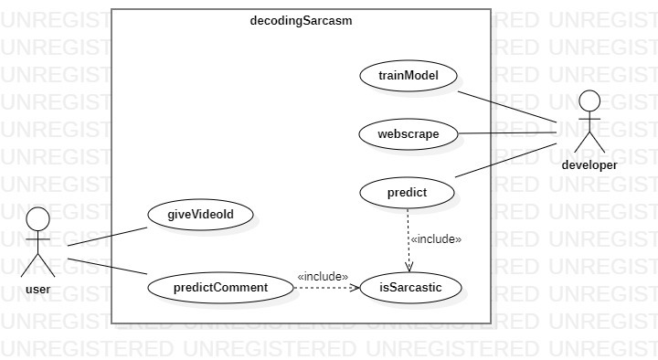

# Decoding-Sarcasm-
Identifying the sarcastic youtube comments.

The project implements a sarcasm detection model using natural language processing (NLP) techniques. It begins by loading a dataset of headlines in JSON format and conducting preliminary data exploration. The headlines are then cleaned by removing special characters, digits, and unnecessary spaces, followed by tokenization, stop word removal, and stemming. Text data is transformed into numerical features using the TF-IDF vectorizer. Logistic Regression, Decision Tree, and Random Forest models are trained on the cleaned text to predict sarcasm. The models are evaluated using metrics such as accuracy, classification report, and confusion matrix, with visualizations of the prediction results. Finally, the trained models are saved using Pickle for future use, and the project allows for input of custom text to predict sarcasm using the trained models. This comprehensive implementation covers the entire workflow from data preprocessing to model evaluation and persistence.

